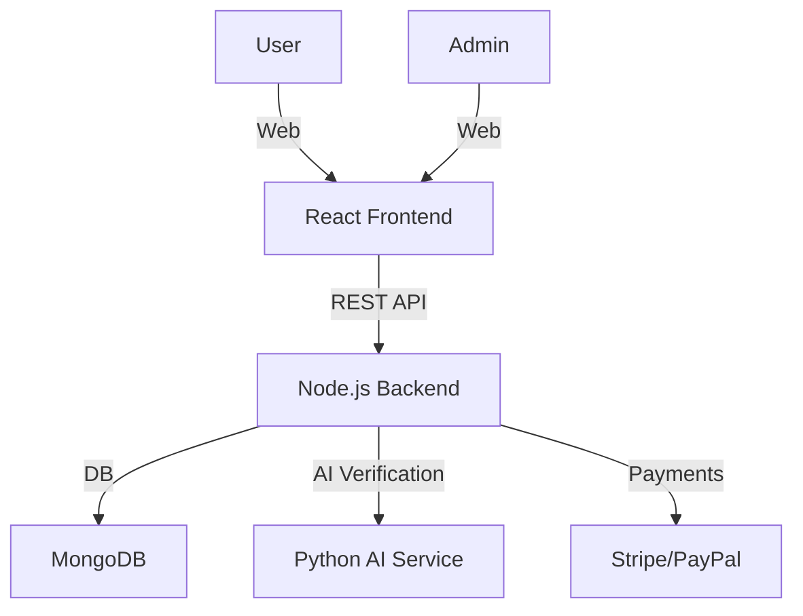

# MindBux: Web-Based Microtask Platform

## Features

- **User Dashboard:** Track earnings, completed tasks, and available microtasks.
- **Task Types:** Image labeling, text tagging, verification, etc.
- **AI Auto-Verification:** Automated quality checks using AI models.
- **Payment Integration:** Secure payouts (e.g., PayPal, Stripe).
- **Admin Task Uploader:** Admins can upload and manage tasks.
- **Modular Backend:** Scalable, maintainable architecture.

---

## Tech Stack

- **Frontend:** React.js (with Material UI)
- **Backend:** Node.js (Express.js)
- **Database:** MongoDB
- **AI Verification:** Python (Flask/FastAPI microservice)
- **Payments:** Stripe/PayPal API

---

## High-Level Architecture



---

## Core Modules

### 1. User Dashboard

- View available/completed tasks
- Track earnings & payment status

### 2. Task Engine

- Serve microtasks to users
- Collect responses
- Send to AI for verification

### 3. AI Auto-Verification

- REST endpoint for task validation
- Returns pass/fail/confidence score

### 4. Payment Module

- Trigger payouts on threshold
- View payment history

### 5. Admin Panel

- Upload/manage tasks (CSV, JSON, images)
- Monitor task progress & quality

---

## Example API Endpoints

```http
POST   /api/tasks/upload         # Admin uploads tasks
GET    /api/tasks/available      # User fetches available tasks
POST   /api/tasks/submit         # User submits completed task
POST   /api/verify/auto          # AI verifies task
POST   /api/payments/request     # User requests payout
GET    /api/dashboard            # User dashboard data
```

---

## Next Steps

- Set up project repositories (frontend, backend, AI service)
- Scaffold React app and Express API
- Integrate MongoDB and Stripe/PayPal
- Develop AI verification microservice
- Build admin and user interfaces
